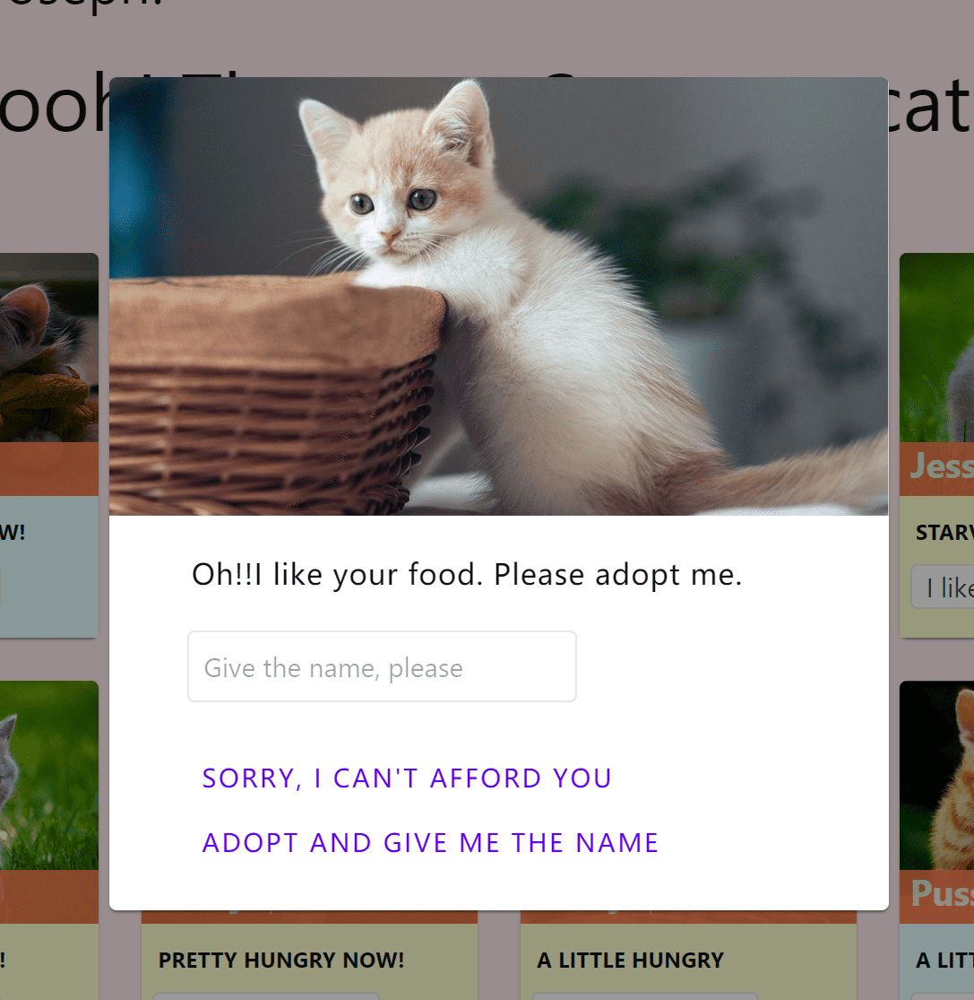
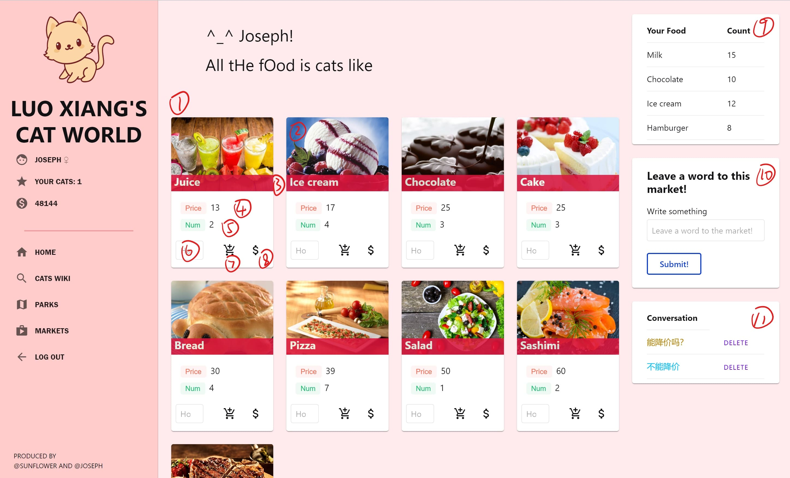

# <center>数据库引论实验报告</center>

[TOC]

## 1 项目介绍

### 1.1 项目背景

　　Cat-World为复旦大学计算机科学技术学院2019年春季开设的《数据库引论》中课程要求的小型项目，该项目需要通过建立数据库模型，并且具有优美的前端展示。其旨在通过这个实现，理解数据库的运行以及SQL语句的理解与书写。本项目由罗翔、解润芃共同完成。Cat-World是依赖数据库关系模型建立的web端简易网页游戏，游戏玩家通过购买与售出食物赚取利润购买食物喂养猫咪。

### 1.2 分工情况

|  |  |  |
| :--: | :--: | :--: |
| 罗翔 | 17307130191 | 主要负责数据库设计以及前后端的部分动态交互以及少量的前端工作，还有数据库数据的收集 |
| 解润芃 |17307130196 | 主要负责游戏机制的设计，前端设计，少部分数据库设计，一些功能调整，以及大部分数据库与后端交互 |

### 1.3 运行方式

```
$ pip install Django 		   //安装Django框架
$ pip install pillow		   //Django中涉及到图片的使用，需要一个第三方库
$ python manage.py runserver   //启动服务器
```

在浏览器中输入http://127.0.0.1:8000/ 即可访问。

### 1.4 Django简介

　　Django是由Python写成的一个开放源代码的Web应用框架，它封装了前端(html)-后端(python)-数据库(sqlite)，使得程序员可以专注于编写应用程序。在传统的数据驱动网站中，Web应用程序会等待来自Web浏览器的 HTTP 请求。当接收到请求时，应用程序根据 URL 和可能的 POST 数据或 GET 数据中的信息确定需要的内容。根据需要，可以从数据库读取或写入信息，或执行满足请求所需的其他任务。然后，该应用程序将返回对Web浏览器的响应，通常通过将检索到的数据插入HTML模板中的占位符来动态创建用于浏览器显示的 HTML 页面。而Django网络应用程序则通常将处理每个步骤的代码分组到单独的文件中：


- **URLs:** URL映射器用于根据请求URL将HTTP请求重定向到相应的视图。URL映射器还可以匹配出现在URL中的字符串或数字的特定模式，并将其作为数据传递给视图功能。
- **View:**  视图是一个请求处理函数，它接收HTTP请求并返回HTTP响应。视图通过模型访问满足请求所需的数据，并将响应的格式委托给模板。
- **Models:**  模型是定义应用程序数据结构的Python对象，并提供在数据库中管理（添加，修改，删除）和查询记录的机制。
- **Templates:** 模板是定义文件（例如HTML页面）的结构或布局的文本文件，用于表示实际内容的占位符。一个视图可以使用HTML模板，通过数据填充它可以动态地创建一个HTML页面模型。


## 2 项目细节

### 2.1 概述——游戏核心机制

Cat-World是为所以喜欢撸猫的人设计的一个猫咪养成类网页小游戏。以Django框架来实现整体功能。游戏中有两类角色，主人和商店管理者。主人可以在商店中购买食物并在公园里给野生的猫咪喂食，当好感度达到一定值时就可以领养小猫；商店管理者则主要是管理商店的货物，可以调整货物价格以及进货情况。

### 2.2 主人视角

在这一个部分，我们主要介绍Cat-World中主人可以执行的操作。我们讲解功能的同时也会对整个界面设计做一个简单地介绍。

#### 2.2.1 <span id="home">Home</span>

这是用户的初始界面，里面记录了主人的基本信息，比如金钱等，同时有一些相对复杂的信息，比如主人有哪些食物、有哪些猫，等等。下面按照编号依次讲解。

<div>
    
</div>
| 标号 | 信息/功能      | 标号 | 信息/功能 | 标号 | 信息/功能 |
| ---- | -------------- | ---- | --------- | ---- | --------- |
| 1    | 主人名字及性别 | 7    | 链接：到达Markets界面 | 13   | 填写猫咪姓名 |
| 2    | 主人猫咪数量               | 8    | 退出登录 | 14   | 选择猫咪性别 |
| 3    | 账户余额 | 9    | 猫咪名字及性别 | 15   | 选择猫咪饥饿状态 |
| 4    | 链接：到达Home界面 | 10   | 猫咪饥饿状态 | 16   | 提交表单 |
| 5    | 链接：到达CatWiki界面 | 11   | 猫咪图片 | 17   | 主人的背包中食物及数量 |
| 6    | 链接：到达Parks界面 | 12   | 喂食选项 | 18   | 提示信息 |

\*一些简单地解释（根据标号）：

- 3：这是主人的资金，用来购买食物喂猫。玩家在账号初始时会获得500猫币，在之后不会有售出商品之外的途径可以获得猫币。
- 9：猫咪的性别不仅可以通过性别符号表示，同时卡片的背景也暗示着猫咪的性别。在这里蓝色小卡片是雄猫，而黄色是雌猫。
- 10：猫咪的饥饿状态会由于喂食以及时间推移而变化。
- 12：选择主人背包中有的食物进行喂养。
- 13、14、15、16：一个简单地猫咪筛选器，可以寻找所有满足条件的猫咪。
- 17：主人的背包，里面的食物从商店购买，会因为喂猫而消耗。
- [相应的代码实现](#homecode)

#### 2.2.2 <span id="cats">Cats Wiki</span>

这个界面可以查看到所有猫咪的信息，以及进行简单搜索。

<div>
    
</div>
1. 猫咪卡片流：所有的猫咪。
2. 猫咪的名字和性别。
3. 猫咪目前的主人是谁，如果没有，显示wild。
4. 猫咪当前的饥饿状态。
5. 猫咪筛选器：和Home的略有不同，这里你可以看见主人信息，所以你可以添加关于主人信息的筛选。
6. 背包，如同Home中相同位置的功能。
7. [相应的代码实现](#catscode)

#### 2.2.3 <span id="parks">Parks & Park</span>

**Parks**

这是小公园列表，这里你可以找到所有的小公园，并且选择进入小公园。

**Park**

这是主人与野生小天使交互的地方。你可以选择喂食猫咪，并且赢得猫咪的青睐。亲密度到达一定程度时，猫咪会请求加入你的猫咪大家庭。这个界面布局和Home界面几乎完全一样，故不再赘述。

<div align="center">
    
</div>
上图是在主人喂食了猫咪足够的食物时弹出的界面。主人可以给猫咪起一个新的名字，并且收养它；或者拒绝收养这只猫咪。

[相应的代码实现](#parkscode)

#### 2.2.4 <span id="markets">Markets & market</span>

**markets**

这是小商店列表，这里你可以找到所有的小商店，查看管理员的消息，并且和所有的商店管理员对话。当然你可以看见你的背包信息。

<div>
    
</div>

| 标号 | 信息/功能    | 标号 | 信息/功能    |
| ---- | ------------ | ---- | ------------ |
| 1    | 小商店卡片流 | 6    | 选择聊天对象 |
| 2    | 小商店图片   | 7    | 提交表单     |
| 3    | 小商店名字   | 8    | 聊天记录表   |
| 4    | 背包信息     | 9    | 删除按钮     |
| 5    | 聊天内容     | 10   | 聊天记录     |

\*一些简单地解释（根据标号）：

- 5，6，7：这是一个简单地对话系统，主人可以选择和一个店老板聊天，输入一条留言，这样这个店老板就能看见你的留言。
- 8，9，10：这是聊天记录表，这里你可以看见你和各个店老板的聊天记录，包含你和谁的对话，谁说的这句话，对话的内容等等信息。当然，你可以删掉任意一个对话。在这里茶色的句子表示这是主人的留言的，蓝色的句子表示店老板的留言。

**market**

在market界面下，主人可以买卖食物。既可以购买食物来喂食小天使们，也可以通过在不同商店间不断地往返来利用不同商店间的差价来获取盈利。当然，你赚到的钱最后还是进入了小猫咪的嘴里。同时，你可以简单地给店老板写留言，只是简单聊几句或者表达对于价格有所不满都是可以的。

<div>
    
</div>

| 标号 | 信息/功能    | 标号 | 信息/功能    |
| ---- | ------------ | ---- | ------------ |
| 1    | 食物卡片流 | 7   | 购买 |
| 2    | 食物的图片 | 8   | 售出 |
| 3    | 食物的名字 | 9   | 背包列表 |
| 4   | 食物的价格 | 10  | 留言系统 |
| 5    | 食物的余量 | 11 | 聊天记录 |
| 6     | 买卖的数量 | 12 |  |

\*一些简单地解释（根据标号）：

- 4：食物的价格总是变动的，在不同的小商店，相同的商品价格仍然可能不一样。
- 5：食物余量。小商店会进货，但你不可以购买比余量更多的食物。
- 10，11：在这里，你只可以留言给当前商店的老板，并且仅能看到你和这个老板的聊天记录。

[相应的代码实现](#marketscode)

#### 2.2.5 小结

这样我们结束了作为主人的全部探索。我们总结一下作为一个主人我们可以做什么。

- 在各个地区走来走去。
- 喂养家中或者公园中的小猫咪。
- 在不同的小商店购买或者售出食物。
- 通过猫咪筛选器选择自己心仪的小猫咪。
- 与所有小商店的店老板聊天，查看聊天并且删除聊天。
- 查看个人基本信息、背包内容等。

### 2.3 <span id="manage">管理员视角</span>

管理员的视角非常简单。管理员能看见的一切都是关于店铺的。一个管理员可以看见店铺中所有商品的价格以及数量。并且他可以知道商店上所有食物的种类。它可以进货或者卖出一定数量的食物，同时可以调整食物的价格。一个管理员可以看见顾客和自己的聊天记录，并且支持添加/删除操作。

<div>
    
    
</div>

| 标号 | 信息/功能    | 标号 | 信息/功能    |
| ---- | ------------ | ---- | ------------ |
| 1    | 管理员名字及性别 | 7   | 商店货物列表 |
| 2    | 管理员管理的小商店 | 8   | 留言信息 |
| 3    | 商店可选食物 | 9   | 留言对象 |
| 4   | 食物卡片 | 10  | 提交表单 |
| 5    | 食物的进货价 | 11 | 聊天记录 |
| 6     | 修改按钮 | 12 |  |

- 4：食物卡片，管理员可以选择购买或售出一定量的食物。当然你不可以售出比自己库存更多的食物。
- 7：管理员特有的功能面板，可以用于修改在该商店中的食物的价格。
- 8，9，10，11：聊天系统，大致功能与符号表示与主人界面一致。不一样的是这里选择的对话对象是与该店铺发生交流的主人。
- [相应的代码实现](#managecode)


## 3 数据库简介

### 3.1 数据库设计

#### 3.1.1 ER图

  

#### 3.1.2 模型设计（表格，实体，主键、外键等等）

数据库中的表都定义在了models.py中，并可以提供相应的操作，需要指出的Django的model一些特性：

- 如果在models.py中没有显式出定义主键的话，Django会自动添加一个ID作为主键。
- Django支持已定义的模型作为外键。
- on_delete=models.CASCADE用在外键中，是指当删除主键时，将与主键相关的外键也同时删除，避免出现外键为NULL。
- 除了常规的属性外，Django也支持图片属性，但需要在settings中设置图片的存放路径，并在图片属性中指明(**upload = X**)，则添加的图片都放在了<http://127.0.0.1:8000/media/X/> 。


我们的模型定义如下：

- **主人**信息包括：主人的ID(Django提供)、名字、性别、金钱、登陆密码、收养的猫咪数目，主键为主人的ID。

```
class Master(models.Model):
    name = models.CharField(max_length=20, help_text="Explore with a lovely name")
    sex_option = (
        ('♂', '♂'),
        ('♀', '♀'),
    )
    sex = models.CharField(max_length=1, choices=sex_option, blank=True)
    money = models.IntegerField(default=500)
    password = models.CharField(max_length=20)
    catnum = models.IntegerField(default=0)
    class Meta:
        ordering = ["name"]
```


- **猫咪**信息包括：猫咪的ID、名字、性别、年龄、饥饿程度、图片链接、主人，主键为猫咪的ID，外键为主人。

```
class Cat(models.Model):
    name = models.CharField(max_length=20, help_text="Enter this cat's name")
    sex_option = (
        ('♂', '♂'),
        ('♀', '♀'),
    )
    sex = models.CharField(max_length=1, choices=sex_option, blank=True)
    age = models.IntegerField()
    hunger_status = (
        ('s', 'I\'m Starving!'),
        ('p', 'Pretty Hungry'),
        ('h', 'Hungry'),
    )
    master = models.ForeignKey('Master',on_delete=models.CASCADE,null=True)
    hunger = models.CharField(max_length=1, choices=hunger_status, blank=True, default='h')
    picture = models.CharField(max_length=100)
```


- **管理员**信息包括：管理员的ID、名字、性别、登录密码、管理的商店，主键为管理员的ID，外键为管理的商店。

```
class Manager(models.Model):
    name = models.CharField(max_length=20, help_text="Explore with a lovely name")
    sex_option = (
        ('♂', '♂'),
        ('♀', '♀'),
    )
    sex = models.CharField(max_length=1, choices=sex_option, blank=True)
    password = models.CharField(max_length=20)
    market = models.ForeignKey('Market', on_delete=models.CASCADE)
```


- **食物**信息包括：食物的ID、名字、效果(给猫咪喂食后所能提高的好感度的基准值)、图片以及基准价格，主键为食物的ID。

```
class Food(models.Model):
    name = models.CharField(max_length=20)
    CHOICES = [(i,i) for i in range(1, 20)]
    effect = models.IntegerField(choices=CHOICES)
    picture = models.ImageField(upload_to='Food')
    baseprice = models.IntegerField(default=30)
```


- **商店**信息包括：商店的ID、名字、图片，主键为商店的ID。

```
class Market(models.Model):
    name = models.CharField(max_length=20)
    picture = models.ImageField(upload_to='Market')
```


- **公园**信息包括：公园的ID、名字、图片，主键为公园的ID。

```
class Park(models.Model):
    name = models.CharField(max_length=20)
    picture = models.ImageField(upload_to='Park')
```


- **主人收养的猫咪**信息包括：主人、收养的猫咪、收养的地点（公园）以及时间，这是一个1:M:1的三元联系，所以只有外键，外键为主人、猫咪、公园。

```
class Adopt(models.Model):
    cat = models.ForeignKey('Cat', on_delete=models.CASCADE)
    master = models.ForeignKey('Master', on_delete=models.CASCADE)
    park = models.ForeignKey('Park', on_delete=models.CASCADE)
    time = models.DateField(null=True, blank=True)
```


- **野生的猫咪**信息包括：猫咪以及猫咪所在的公园，这是一个1:M的二元联系，外键为猫咪和公园。

```
class Wild(models.Model):
    cat = models.ForeignKey('Cat',on_delete=models.CASCADE)
    park = models.ForeignKey('Park',on_delete=models.CASCADE)
```


- **主人拥有的食物**信息包括：主人、食物以及数目，这是一个M:N的二元联系，外键为主人和食物。

```
class Store(models.Model):
    food = models.ForeignKey('Food', on_delete=models.CASCADE)
    master = models.ForeignKey('Master', on_delete=models.CASCADE)
    num = models.IntegerField(default=0)
```


- **商店买卖的食物**信息包括：食物、商店、数量以及加个，这是一个M:N的二元联系，外键为食物和商店。

```
class Sell(models.Model):
    food = models.ForeignKey('Food', on_delete=models.CASCADE)
    market = models.ForeignKey('Market', on_delete=models.CASCADE)
    num = models.IntegerField(default=1)
    price = models.IntegerField(default=1)
```


- **主人喂养的猫咪**信息包括：主人、喂养的猫咪、好感度，这是一个M:N的二元联系，外键为主人和猫咪。

```
class Feed(models.Model):
    cat = models.ForeignKey('Cat', on_delete=models.CASCADE)
    master = models.ForeignKey('Master', on_delete=models.CASCADE)
    intimacy = models.IntegerField(default=50)
```


- **留言**信息包括：主人、商店、留言内容以及留言的方向，这是一个M:N的二元关系，外键为主人和商店。

```
class Conversition(models.Model):
    master = models.ForeignKey('Master', on_delete=models.CASCADE)
    market = models.ForeignKey('Market', on_delete=models.CASCADE)
    words = models.CharField(max_length=50, blank=True, null=True)
    CHOICES = [(i,i) for i in range(1, 3)]
    direct = models.IntegerField(choices=CHOICES)
```


### 3.2 涉及数据库的操作

Django通过URL映射器(urls.py)将前端的请求都重定向到相应的Views视图(views.py)中处理。视图中通过模型来访问数据库中的相关表，并将结果返回给前端。以下通过实例简要说明：

```
// urls.py
urlpatterns = [
    path('<int:master_id>/cats/', views.cats),
]

// views.py
class cats(request, master_id):
	do something
	...
	context = {'cat_list':cat_list...}
	return render(request, 'games/cats.html', context)
```

当在“<http://127.0.0.1:8000/int:master_id>/cats/”界面发出请求时，通过urlpatterns重定向到views.py中的cats函数，同时传入一个int类型的参数master_id。cats函数中，对数据库进行增、删、查、改操作，然后将前端显示的内容(context)通过return函数将内容显示在"games/cats.html"模板中。

需要指出的Django的views的一些特点：

- views.py中可以通过request.POST['X']获得前端输入的相关内容。

- views.py中筛选有两种方式

  - Model.objects.filter()
  - Model.objects.get()

  其中filter返回一个元组，get返回一个元素。

- views.py同时也支持通过外键的部分属性来获得关系，下面通过一个实例来讲解。

```
cat_list=Adopt.objects.filter(master__name=master.name)
```

这里Adopt是模型Master和Cat之间的一个M:N的二元联系，Master和Cat为它的外键。在上例中，我们想查找一个主人收养的猫，可以直接通过外键Master中name元素来筛选。


#### 3.2.1 面向主人的操作

- 注册账号

```
//通过request.POST获得新建账户的 username, password, sex
//判定新建账户是否合法：username,password,sex均不准为空，且username不准与数据库中已有的账户重复
username, password, sex = request.POST['XXX']
if the newly created account is legal
	master = Master.objects.create(name=username,password=password,sex=sex)
	master.save()
	return render(request,'games/detail.html',{'master':master})
else:
	balabala
```


- 登陆账号

```
//通过request.POST获得用户的 username, password, role，并根据用户的类型role进行相关操作
username, password, role = request.POST['XXX']
if role is master:
	//当用户类型为master时，检索数据库中是否有对应的用户如果有，则进入用户界面
	if Master.objects.filter(name__exact=username,password__exact=password):
		//通过外键，将主人拥有的食物和收养的猫从数据库中筛选出来
    	master = Master.objects.get(name__exact=username,password__exact=password)
        cat_list=Adopt.objects.filter(master__name=master.name)
        food_list=Store.objects.filter(master__name=master.name)
	else:
        No such id. Please sign up first!
```


- <span id="homecode">个人信息</span>

[对应功能的界面展示](#home)
  - 查看背包

  ```
  //查看一个主人拥有的食物
  food_list=Store.objects.filter(master__name=master.name)
  ```

  - 查看基本信息

  ```
  //根据传入的master_id查找对应的master，在主键中相应显示master的属性
  master = get_object_or_404(Master, pk=master_id)
  ```

  - 查看拥有猫咪

  ```
  //查找一个主人收养的猫
  cat_list=Adopt.objects.filter(master__name=master.name)
  ```

  - 喂食家中猫咪

  ```
  //获得喂食的信息，哪一只猫咪(ID)，哪一种食物(name)
  food, cat = request.POST.get('X')
  food = Food.objects.get(name = food)
  cat = Cat.objects.get(id = cat)
  if Store.objects.filter(master = master, food = food):
  //根据master, food筛选出主人现在所拥有的食物
  	store = Store.objects.get(master = master, food = food)
      //如果数量为1，则喂食以后就没有了，需要从数据库中删除，否则只是改变数据库中的值
  	if store.num == 1:
      	store.delete()
      else:
          store.num = store.num - 1
          store.save()
      //喂食完以后，调整猫咪的饥饿状态
      if cat.hunger=='s':
          cat.hunger='p'
          cat.save()        
      elif cat.hunger=='p':
          cat.hunger='h'
          cat.save()
  ```


- <span id="catscode">查看所有猫咪信息</span>

[对应功能的界面展示](#cats)

```
//根据猫咪的名字对所有猫咪进行排序
cat_list = Cat.objects.order_by('-name')
```


- 猫咪筛选器

```
catname, catsex, catmaster, cathealth=request.POST.get('X')
//当有多个关键字时则逐级筛选
if catname:
	cat_list = Cat.objects.filter(name=catname)
else:
	cat_list = Cat.objects.order_by('-name')
if catsex and catsex!='All':
	cat_list = cat_list.filter(sex=catsex)
if cathealth and cathealth!='All':
	cat_list = cat_list.filter(hunger=cathealth)
if catmaster and catmaster!='All':
	cat_list = cat_list.filter(master__name=catmaster)
```


-   <span id="parkscode">公园相关</span>

[对应功能的界面展示](#parks)
  - 查看公园列表

  ```
  //根据名字排序并取出前五个
  park_list = Park.objects.order_by('-name')[:5]
  ```

  - 查看公园中猫咪情况

  ```
  cat_list = Wild.objects.filter(park__id= park_id)
  ```

  - 喂食公园中猫咪

  ```
  //获得喂食的信息，哪一只猫咪(ID)，哪一种食物(name)
  food, cat = request.POST.get('X')
  if cat and food:
  	food = Food.objects.get(name = food)
  	cat = Cat.objects.get(id = cat)
  	//根据主人和猫咪获得喂食的猫咪这个关系，如果这个主人以前没有喂食过这只猫咪则数据库中没有这个数据，那么就直接建立一个关系
  	feed, created = Feed.objects.get_or_create(master = master, cat = cat)
      if Store.objects.filter(master = master, food = food):
          do as what we do in feeding cats home
          ...
          //根据猫咪的饥饿情况以及食物的效果增加好感度
          if cat.hunger=='s':
              feed.intimacy += food.effect*3
              cat.hunger='p'  
          elif cat.hunger=='p':
              feed.intimacy += food.effect*2
              cat.hunger='h'
          else:
              feed.intimacy += food.effect
  	cat.save()
  	feed.save()
  ```

  - 领养猫咪

  ```
  //当喂食的好感度达到100时，猫咪会询问你是否能收养它，如果收养的话，还可以重新给他命名
  id, adopt_name = request.POST.get('X')
  //获得将要收养的猫咪
  adopt_cat = Cat.objects.get(id = id)
  try:
  	wild_delete=Wild.objects.get(park=park,cat=adopt_cat)
  except Wild.DoesNotExist:
  	wild_delete = None
  if adopt_cat and wild_delete:
  	//如果有改名的话则对猫咪的名字修改，收养猫咪则需要创建一个Adopt
      if adopt_name:
      	adopt_cat.name = adopt_name
      adopt_new=Adopt.objects.create(master=master,cat = adopt_cat,park=park)
      //更新主人领养的猫的数目等一些信息，并且因为不再是野猫，则需要将对应的Wild删除
      master.catnum+=1
      master.save()
      adopt_new.save()
      wild_delete.delete()
      adopt_cat.master=master
      adopt_cat.save()
  ```


-   <span id="marketscode">商店相关</span>
[对应功能的界面展示](#markets)
  - 查看商店列表

  ```
  market_list = Market.objects.all()
  ```

  - 查看商店售卖食物

  ```
  market_food = Sell.objects.filter(market = market)
  ```

  - 买/卖食物

  ```
  buy, sell, food, num = request.POST.get('X')
  if (buy or sell) and food and num:
  	if buy:#buy
      	for i in range(len(food)):
      		//找到主人要买的食物
              if food[i] and num[i]:
              	myfood = Food.objects.get(id = int(food[i]))
              //找到商店中对应提供的食物
              if Sell.objects.filter(market = market, food = myfood):
              	buy = Sell.objects.get(market = market, food = myfood)
                  Num = int(num[i])
              //当主人想要购买的食物的数量大于商店所有时，
              if Num > buy.num:
  				Don't have enough food
              //当主人的钱不够时，
              elif master.money < Num * buy.price:
              	Don't have enough money
              //交易达成，更新主人背包，主人的金钱，以及商店中的食物
              else:
              	store, created = Store.objects.get_or_create(master = master, food = myfood)
                  master.money -= Num * buy.price
                  master.save()
                  if buy.num == Num:
                  	buy.delete()
                  else:
                  	buy.num -= Num
                      buy.save()
                      store.num += Num
                      store.save()
  	else:#sell
      	just reverse
  ```

  - 查看与商店管理员的对话

  ```
  conver_list=Conversition.objects.filter(master=master,market=market)
  ```

  - 创建与商店管理员的对话

  ```
  conver_flag, conver_context = request.POST.get('conver_flag')
  //如果检测到有人创建了对话，则在数据库中加入相关信息
  if conver_flag:
  	conver=Conversition.objects.create(master=master, market=market, words=conver_context, direct=1)
  	conver.save()
  ```

  - 删除与商店管理员的对话

  ```
  conver_delete, conver_delete_id = request.POST.get('conver_delete')
  //如果检测到有人删除了对话，则在数据库中删除相关内容
  if conver_delete and Conversition.objects.filter(id=conver_delete_id):
  	conver=Conversition.objects.get(id=conver_delete_id)
      conver.delete()
  ```


#### 3.2.2  <span id="managecode">面向管理者的操作</span>


[对应功能的界面展示](#manage)

- 登入管理员界面

```
if the role is manager:
	//当用户类型为manager时，检索数据库中是否有对应的用户如果有，则进入管理员界面
	if Manager.objects.filter(name__exact=username,password__exact=password):
		//通过外键，找到属于管理员的商点，并将商店中的食物以及商店参与的对话筛选出来
        manager = Manager.objects.get(name__exact=username,password__exact=password)
        market=manager.market
        market_food = Sell.objects.filter(market = market)
        all_food = Food.objects.all()
        conver_list=Conversition.objects.filter(market=market)
	else:
        No such id. Please sign up first!
```


- 查看个人信息

```
manager = get_object_or_404(Manager, pk = manager_id)
market=manager.market
```


- 查看仓库情况

```
market_food = Sell.objects.filter(market = market)
```


- 查看所有食物情况

```
all_food = Food.objects.all()
```


- 调整食物价格

```
change, price, food_id = request.POST.get('X')
if change:
	sell=Sell.objects.get(market=market,food__id=food_id)
	sell.price=price
	sell.save()
```


- 调整进货情况

```
buy, sell, food, num = request.POST.get('X')
if (buy or sell) and food and num:
	judge=market_food.filter(food=food)
    if buy:#buy
    	//进货时如果商店中已经有货物则只改变num，否则创建一个对应的Sell
    	if judge:
        	sell=market_food.get(food=food)
            sell.num+=int(num)
        else:          
        	sell=Sell.objects.create(price=food.baseprice, market=market, num=num, food=food)
        sell.save()
	else:#sell
    	just reverse
```


- 与买家对话系统

  与主人的对话系统相对应。


#### 3.2.3 一些潜在的操作

这个游戏同时通过随机数来实现一些随机变化，包括：商店食物种类和数目变化、公园中的猫咪随机出现、以及家中的猫咪因为饥饿而逃离

- 食物的随即生成

```
lenth = len(delicious)  //lenth为食物种类
type = random1 % lenth	//随机挑选出挑选出一种食物
stock_list=Sell.objects.filter(market = market, food = delicious[type])
if stock_list:			//如果商店中有的话则直接更新
	stock=stock_list[0]
else:					//没有的话，则需要创建一个Sell
	stock = Sell.objects.create(market = market, food = delicious[type], price=delicious[type].baseprice)
takein = random2 % 4
//商品数目和价格的浮动规则，数目必须<=100
if stock.num + takein < 100:
	stock.num += takein
else:
	stock.num = 100
```


- 食物价格的随机波动

```
//价格超过给定区间[30, 300]时需要向中心靠拢，其他时候保证浮动<=6
if stock.price>300:
	stock.price-=20
elif stock.price<30:
	stock.price+=5
else:
	stock.price+=(random3%13-6)
stock.save()
```


- 猫的随机生成

```
／／如果公园中猫咪的数目<=16，则有1/2的几率出现一只新的猫咪
if len(cat_list)<16 and now_time<1:
	sex_ran=(random)%2
	//决定一只新出现的猫咪的性别以及饥饿程度并设置图片链接
    if sex_ran==0:
        sex_create='♂'
    else:
        sex_create='♀'
    hunger_ran=(random2)%3
    if hunger_ran==0:
        hunger_new='s'
    elif hunger_ran==1:
        hunger_new='p'
    else:
        hunger_new='h'
    catpicture = (random3)%23
	catpicture = os.path.join(Cataddress, catpicture.__str__() + ".jpg").replace('\\','/')
	//根据性别在不同的名字集合(for male and female)里创建相应的猫咪
	if sex_ran==0:
		cat_create = Cat.objects.create(name=name_list_male[(random4)%name_length_male],sex=sex_create,hunger=hunger_new,age=1,picture=catpicture)
	else:
		cat_create = Cat.objects.create(name=name_list_female[(random5)%name_length_female],sex=sex_create,hunger=hunger_new,age=1,picture=catpicture)
    cat_create.save()
    wild_create = Wild.objects.create(park=park,cat=cat_create)
    wild_create.save()
```


- 猫的饥饿机制

```
//猫咪有1/17的几率变饿
for mastercat in cat_list:
    cat_now=mastercat.cat
    if random[mastercat]%17==0:
    	if cat_now.hunger=='h':
        	cat_now.hunger='p'
            cat_now.save()
        elif cat_now.hunger=='p':
        	cat_now.hunger='s'
            cat_now.save()
```


- 猫的逃离机制

```
//当猫咪非常饥饿时，他就会逃离
if cat_now.hunger=='s':
    length=len(Park.objects.all())
    wild_ran=int(time.time()*10000*cat_now.id)%length+1
    wildpark=Park.objects.get(id=wild_ran)
    wild_new=Wild.objects.create(park=wildpark,cat=cat_now)
    wild_new.save()
    admin=Master.objects.get(name__exact='Admin')
    cat_now.master=admin
    cat_now.save()
    mastercat.delete()
    master.catnum-=1
    master.save()
```


## 4 web界面介绍

本部分主要涉及Cat-World的界面设计，我们会陈述设计理念以及布局实现等。

#### 4.1 设计理念

Cat-World严格遵从2014年谷歌公司为移动端设备推出的Material Design涉及规范（后简称MD）。我们希望借助最为简单的、有秩序的、一致的元素传递有效的、丰富的、易于阅读的信息。通过在静态界面上融入一些简易的、富有提示性的交互，我们希望提供用户亲切、自然的游戏体验。

#### 4.2 布局

为了更友好的用户体验，我们希望通过我们的布局传达出更加有效的信息。我们希望做到即使在不同界面，相似的位置所承载的功能也应当是相似的，从而使用户可以直接通过卡片来获取信息而非抓取文字。 

于是我们采用功能上统一的布局，将一个web界面分为三栏设计（称为左栏、右栏、中部）。左栏为信息栏与功能栏，用户可以找到自己的基本信息，以及通过相应的按钮到达相应的功能分区。右栏为操作栏，这里集中了大部分用户与所在页面的交互功能，用户可以通过在操作栏中进行一些的操作，例如建立与管理者的对话、使用Cat-Filter查询想要找到的猫咪。而中部分割为上下两个部分，其上部分为欢迎等界面提示语句，而下部统一为“卡片流”，即秩序排布的卡片序列，这些卡片根据界面不同而呈现不一样的内容。在不同的界面，卡片上可能会提供相应的简单操作，例如喂食猫咪等。

显然，这样的布局使得玩家即使在任何一个界面都不应该感到陌生，知道自己所在的位置（通过提示语句），知道自己可以进行的操作（通过右栏）。

#### 4.3 元素

**卡片**

MD规范的主要元素即是“卡片(card)”。卡片是一种有效的信息载体，它可以清晰地呈现一个对象的相关信息，提供包括图片、符号、文字、颜色等多类信息，并且以非常明显的边界与其他信息划分开。毫无疑问，采用卡片结构，用户总是知道每部分文字是针对什么内容的，可以在浏览过程中更有效获取信息。

而Cat-World通过卡片呈现几乎所有的信息。在我们的设计中，卡片是信息以及交互的唯一展示容器。我们将右栏中不同的功能整理为不同的卡片，使得功能分区非常明显，并且富有秩序性。

即使采用卡片，仍可以有很大的发挥空间。我们针对不相同的信息做出了不一样风格的卡片。如“食物的卡片”，“公园的卡片”，“猫的卡片”，“功能区的卡片”。这些卡片呈现出明显的区别，但又因为相同的圆角、基色等原因结合在一起，以既统一又多样的方式构成了用户所看见的一切。

**符号**

当使用的符号能被人们所理解，符号是一种较文字更为清晰、友好的交互元素。Cat-World采用了MD规范提供的icon规范——这个规范在大部分遵守MD设计规范的Android以及web应用中非常常见。这些符号，由于为移动端设计，本身具有线条简单、意义清晰等重要的性质，其在这样一个简单地游戏框架中展现出良好的效果。

#### 4.4 主题

Cat-World是一个喂养猫咪的游戏，毫无疑问，其面向对象为富有爱心、爱猫的玩家。所以我们希望尽可能地是我们的主题显得亲切、温暖、轻松。于是我们使用暖色作为界面的底色；但是只是使用暖色调容易使人在浏览过程中感到乏味，于是我们加入了点缀式的中性或者偏冷的色调完成其他细节信息的展示。同样白色的出现是必要的，白色给人一种平缓的感觉。

#### 4.5 动画&交互

**动画**

Cat-World的设计理念中“简单”毫无疑问是最为重要的。我们希望动画或者交互的功能应当是提示性的、潜在的或者使人感到惊喜的，而非是使得界面由于具有过多无意义的动画而丧失主题。所以在动画以及交互的设计中，我们采用的动画或是必要的，或是在浏览过程中使人感到舒适或者惊奇的。

我们主要的动画分为进场动画，以及潜在动画。进场动画指进入这个界面时，在界面上相应的组件到达其位置工程中的呈现。我们使用了一个“向中央移动”的统一风格完成进场动画。在布局中我们曾提到了三栏布局，在设计中，我们固定住左栏，因为它的信息没有任何变化，过多的动画会分散用户注意力；而活动右栏，中部的上下两部分：右栏从web右端进入视线，中部两部分分别从上下进入视线，从而呈现出从周围向中央移动的效果。

这样的移动是秩序的、富有提示性的。同时通过这样”清零从来“的动画提示用户功能区的转化，完成界面信息和意义的刷新。

**交互**

交互相当的简单。用户通过点击界面上的按钮实现不同的功能，通过界面呈现的信息获取反馈。部分信息会通过中部的上栏提示语句，或者通过弹窗的模式得到。我们认为用户应当及时获取重要信息。除此之外，我们采用了一点点有意思的潜在交互。当用户移动到某些特殊的区域时，相应的组件会以意想不到的方式开始简单地抖动。当这个特效使用在猫咪卡片的时候，它的效果是非常棒的。当然一些文字的抖动使得这个游戏更加亲切、自由。


## 5 参考

### 5.1 web模块链接

\[1\]. [Material Design设计简易组件框架](https://unpkg.com/material-components-web@latest/dist/material-components-web.min.css)

\[2\]. [Material Design图标](https://fonts.googleapis.com/icon?family=Material+Icons)

\[3\]. [Kube UI Framework](https://imperavi.com/kube/)

\[4\]. [bounce.js](http://bouncejs.com/)

\[5\]. [Animate.css](https://daneden.github.io/animate.css/)

\[6\]. [Shake css](https://elrumordelaluz.github.io/csshake/)

\[7\]. [Material Design Color Tool](https://material.io/tools/color/#!/?view.left=0&view.right=0)

\[8\]. [neoteric字体](https://www.dafont.com/neoteric.font?psize=s)

[9]. [响应式的账号登录界面模板](http://www.17sucai.com/pins/32010.html)

### 5.2 参考教程以及文献
\[1\]. [Django文档](https://docs.djangoproject.com/zh-hans/2.2/intro/tutorial01/)

\[2\]. [MDN web docs on Django Tutorial Part](https://developer.mozilla.org/zh-CN/docs/Learn/Server-side/Django)

\[3\]. [Material Design设计规范](https://material.io/)

\[4\]. [Material Design Lite](https://getmdl.io/)

\[5\]. [W3School](http://www.w3school.com.cn/)

[6]. [菜鸟教程](https://www.runoob.com/html/html-tutorial.html)

